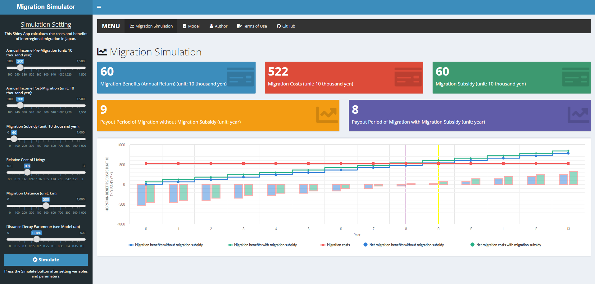

# Migration Simulator

## Shiny Web Application
This Shiny Web Application calculates the costs and benefits of interregional migration in Japan based on my research (Kondo, 2019).  
URL: https://keisuke-kondo.shinyapps.io/migration-simulator-en/

## Replication Files
The R code of the Shiny App is available on GitHub.  
URL: [https://github.com/keisukekondokk/migration-simulator-en](https://github.com/keisukekondokk/migration-simulator-en)

## Terms of Use
Users (hereinafter referred to as the User or Users depending on context) of the content on this web site (hereinafter referred to as the Content) are required to conform to the terms of use described herein (hereinafter referred to as the Terms of Use). Furthermore, use of the Content constitutes agreement by the User with the Terms of Use. The content of the Terms of Use is subject to change without prior notice.

### Copyright
The copyright of the developed code belongs to Keisuke Kondo.

### Copyright of Third Parties
Some of the Content may contain content provided by third parties. Users must not infringe copyright works of the third parties.

### License
The developed code is released under the MIT License.

### Disclaimer
<ul>
<li>Keisuke Kondo makes the utmost effort to maintain, but nevertheless does not guarantee, the accuracy, completeness, integrity, usability, and recency of the Content.</li>
<li>Keisuke Kondo and any organization to which Keisuke Kondo belongs hereby disclaim responsibility and liability for any loss or damage that may be incurred by Users as a result of using the Content. Keisuke Kondo and any organization to which Keisuke Kondo belongs are neither responsible nor liable for any loss or damage that a User of the Content may cause to any third party as a result of using the Content</li>
<li>The Content may be modified, moved or deleted without prior notice.</li>
</ul>

## Author
Keisuke Kondo  
Senior Fellow, Research Institute of Economy, Trade and Industry  
Associate Professor, Research Institute for Economics and Business Administration, Kobe University  
Email: kondo-keisuke@rieti.go.jp  
URL: https://keisukekondokk.github.io/  

## Reference
Kondo, Keisuke (2019) "Monopolar Concentration in Tokyo and Promotion of Urban-to-Rural Migration," RIETI Policy Discussion Paper No. 19-P-006  
URL: https://www.rieti.go.jp/en/publications/summary/19040007.html  
